# My-Editter
Editter is a clone of the very famous text editor Microsoft Word.
It is created using the Tkinter module and I have created various types of functions in it like making text bold, italic, underlined, changing colors, and performing various operations on data like saving file ,opening documents, creating new documents. Editter also contains scroll bar, word and character counts.

Here is a screenshot:  

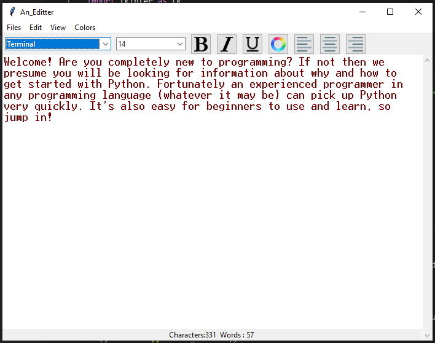

# License
This uses the [MIT License](LICENSE).

# Features

## Files
This menu can be accessed by clicking on the "Files" item on the topmost bar.
- To create a new file, select the "New" option.
- To open an existing file, select the "Open" option.
- To save whatever has been written the Editter, select the "Save" option.
- To save whatever has been written the Editter to a new file, select the "Save As" option.
- To exit Editter, select the "Exit" option.

Here is a screenshot of the "Files" menu:

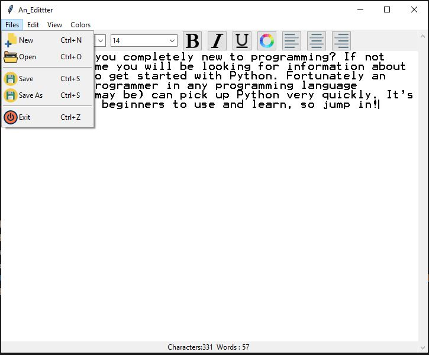

## Edit
This menu can be accessed by clicking on the "Edit" item on the topmost bar.
- To copy selected text, select the "Copy" option.
- To paste text, select the "Paste" option.
- To cut selected text, select the "Cut" option.
- To find or replace specific text, select the "Find" option. A new window will appear with the "Find" and "Replace" field to find specified text and replace them the text provided.

Here is a screenshot of the "Edit" menu:

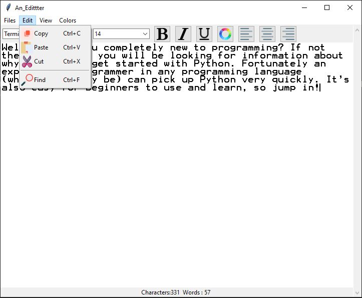

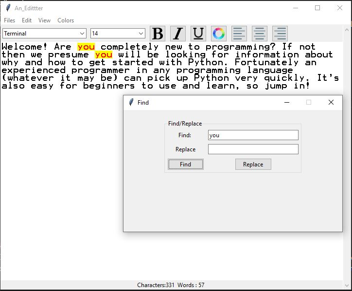

## View
This menu can be accessed by clicking on the "View" item on the topmost bar.
- To show/hide the Status Bar, select the "Status Bar" option. A tick will represent if the "Status Bar" is shown or hidden.
- To show/hide the Tool Bar, select the "Tool Bar" option. A tick will represent if the "Tool Bar" is shown or hidden.

Here is a screenshot of the "View" menu:

## Colors
This menu can be accessed by clicking on the "Colors" item on the topmost bar.
- To change the color theme of the Editter, select the color from the menu. A tick will represent the selected color.

Here is a screenshot of the "Colors" menu:

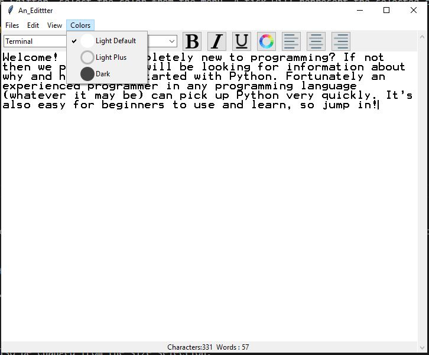

## Tool Bar Options
The Tool Bar contains options to change the text in the Editter. To ensure the Tool Bar is shown, make sure that the "Tool Bar" option in the "View" menu is selected.

- The font of the text in the Editter can be changed from the font selection.

Here is a screenshot of the font selection menu:

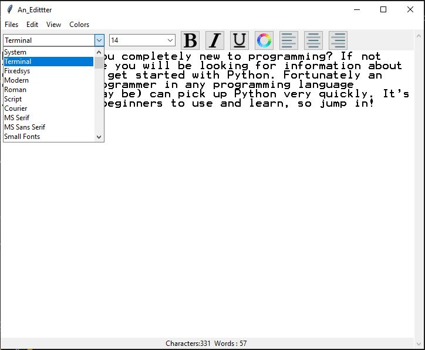

- The font size of the text can also be changed from the size selection.

Here is a screenshot of the size selection menu:

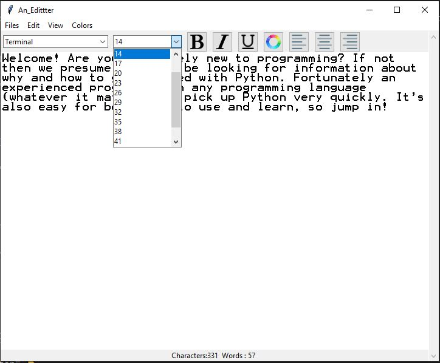

- The font styling of the text, including Bold, Italic and Underlined can be set from these buttons.

Here is a screenshot of the "Bold" button:

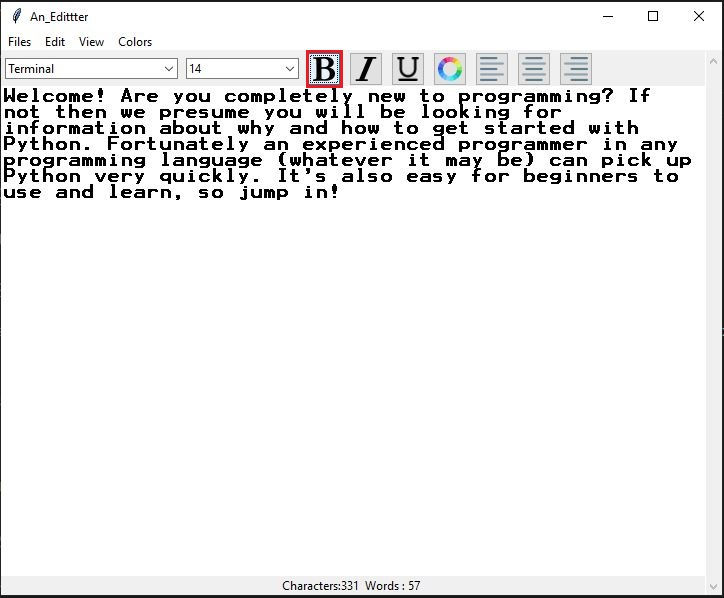

Here is a screenshot of the "Italic" button:

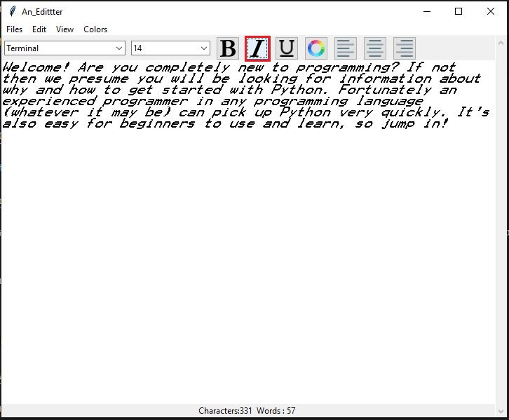

Here is a screenshot of the "Underline" button:

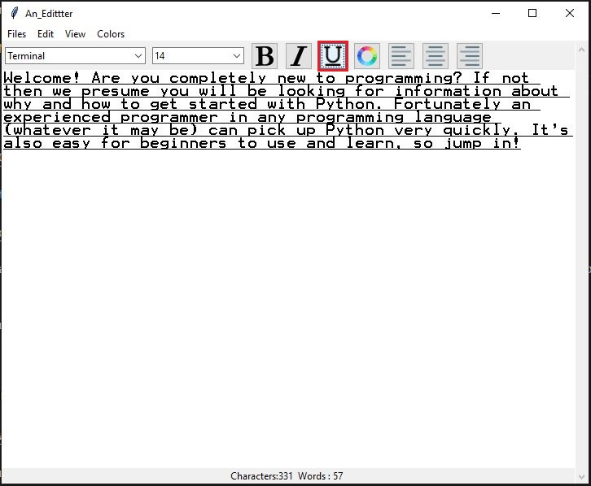

- The color of the text can be changed by selecting the Color Picker. A window with a full color picker will appear and the font color can be chosen.

Here is a screenshot of the color picker:

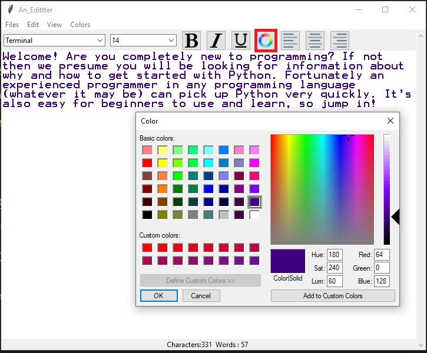

- The justification (alignment) of the text, including Left, Center and Right can be set from these buttons.

Here is a screenshot of the "Left" justify button:

Here is a screenshot of the "Center" justify button:

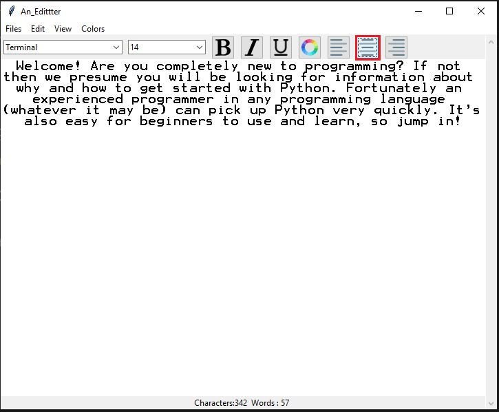

Here is a screenshot of the "Right" justify button:

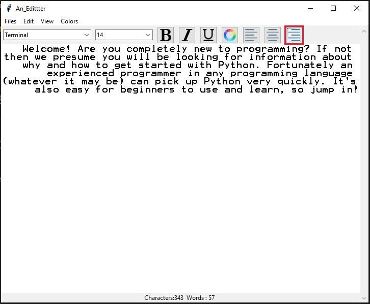

## Status Bar
The status bar shows the number of characters and words written in the Editter in total.

Here is a screenshot of the status bar:

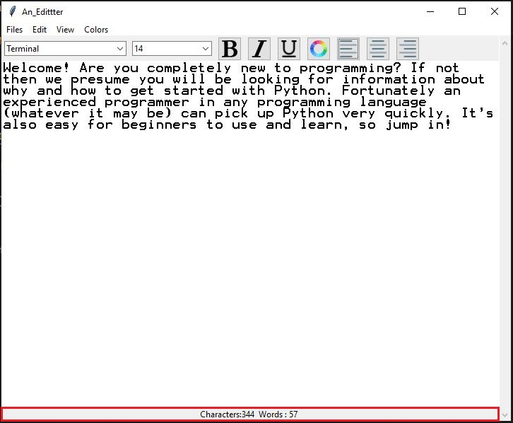
